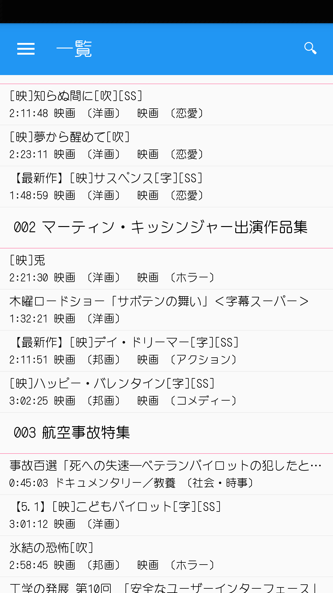
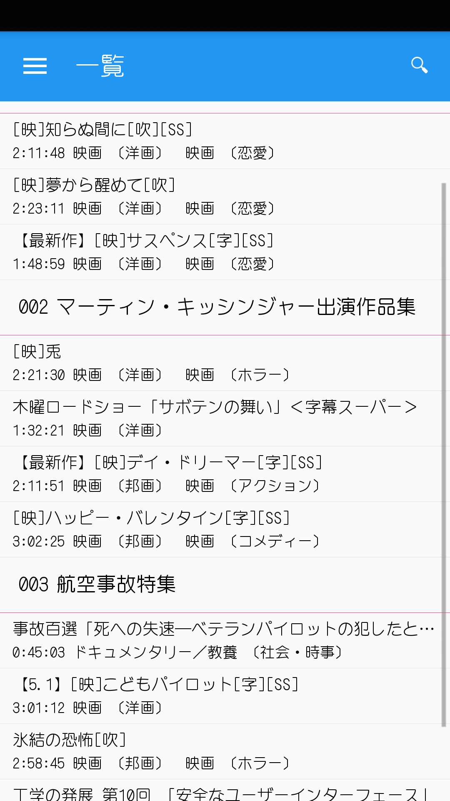
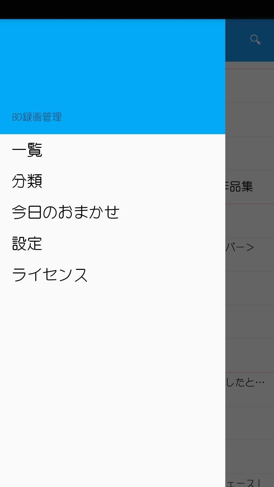
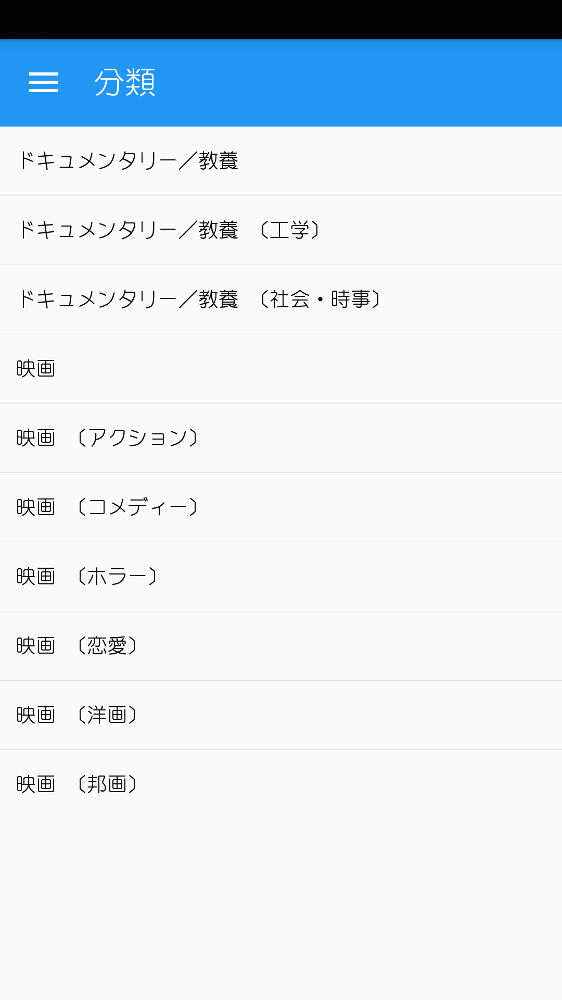
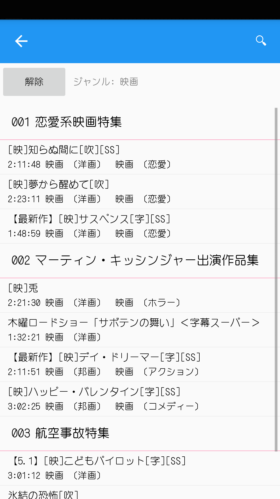
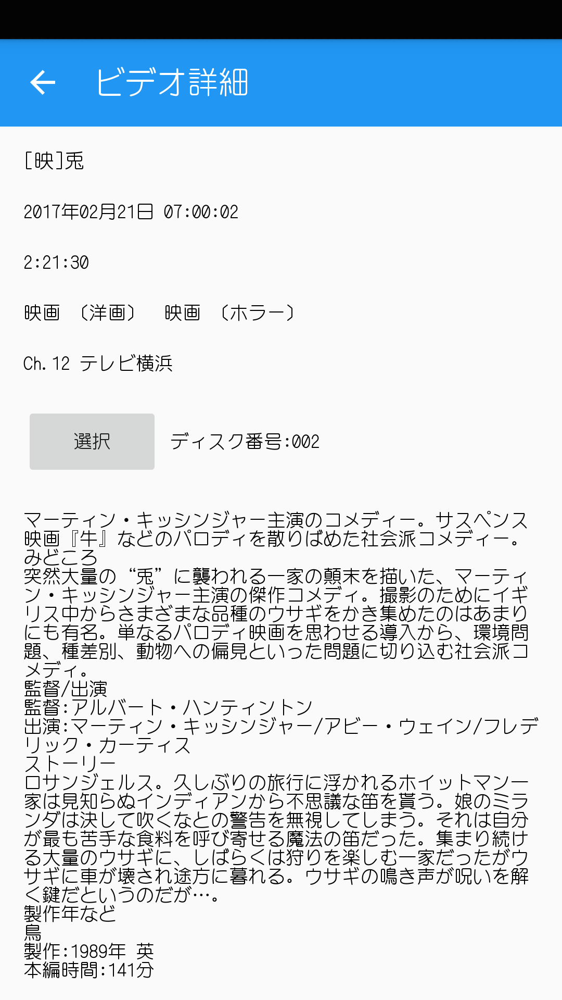

# BDVideoLibraryManager
## Access
[Androidアプリ](https://play.google.com/store/apps/details?id=com.github.kurema.BDVideoLibraryManager)

[Windows版](https://github.com/kurema/BDVideoLibraryManager/releases/download/1.0.0.0/Win.zip)

## Info
Androidアプリ単独では意味がありません。
Windows版をダウンロードして、ディスクを取り込み、そのフォルダを共有してください。

## About
このツールは以下の3つの機能を含みます。
* BD-AV形式のBlu-ray Discに含まれる録画内容をディスク毎にcsv化するツール。
* それらの情報をWindowsデスクトップ上で確認・検索するソフト。
* Xmarin Formsを利用し、Android上からSMB共有されたcsvファイルを確認・検索するアプリ。

## How to use
1. パソコンにBDドライブを接続して管理情報を取り込む。
2. 当該フォルダをファイル共有するかNASに転送する。
3. PC上やAndroidから管理情報を見る(SMB経由。csvのまま)。
4. 見たい映像が含まれるディスクを確認して、探して、見る。

より詳細にWindows上での作業を説明します。

1. Win.zipをダウンロードして適当なフォルダに展開(releases→Win.zip)。
2. VideoLibraryManager.exeを実行し、取り込む(取り込み→ドライブ・ディスク名指定→取り込み)。
3. 当該フォルダをファイル共有。あるいはNAS上などに移動。
4. Android版をインストール。設定を選び、サーバー名・パス・ユーザー名・パスワードを設定。これでキャッシュされる。データ更新時には、一覧画面でプルダウンすれば再ダウンロード可能。

バッチファイルを使う場合。

1. Toolsをダウンロードして適当なフォルダに展開(releases→Tools.zip)。
2. フォルダ内の"copy.bat"を編集。E:¥を実際のBDドライブのドライブレターに書き換える。
3. ドライブにBDを一枚づつ挿入。その度にcopy.batを実行する(挿入から読み込みまで多少の時間を要します)。
4. 全てのBDドライブを読み込んだらrpls2csv.batを実行する。
5. できたcsvフォルダを適当な場所に移動して、共有フォルダやNASのCIFS/SMB機能でLan内に公開。
6. csv/の上層フォルダにWindows版(releases→Win.zipを展開)を配置。これでWindowsで閲覧ができる。

## Screenshots
Android:
| | | |
| -- | -- | -- |
|  |  |  |
|  |  |  |

Windows:
| | |
| -- | -- |
|  |  |

## Thanks
以下の協力を以て本ツールは作られています。
* BD-AVに含まれる情報の取得には Vesti La Giubba様の[bdavinfo](http://saysaysay.net/bdavtool/bdavinfo)を利用しています。
* CSVファイルの解析にはJoshClose様のCsvHelperを利用しています。
* SMBへのアクセスには[TalAloni](https://github.com/TalAloni/)様の[SMBLibrary](https://github.com/TalAloni/SMBLibrary)を利用しています。
* このアプリはXamarin Formsで作られています。
